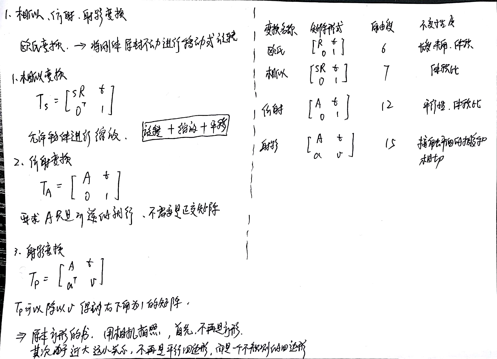
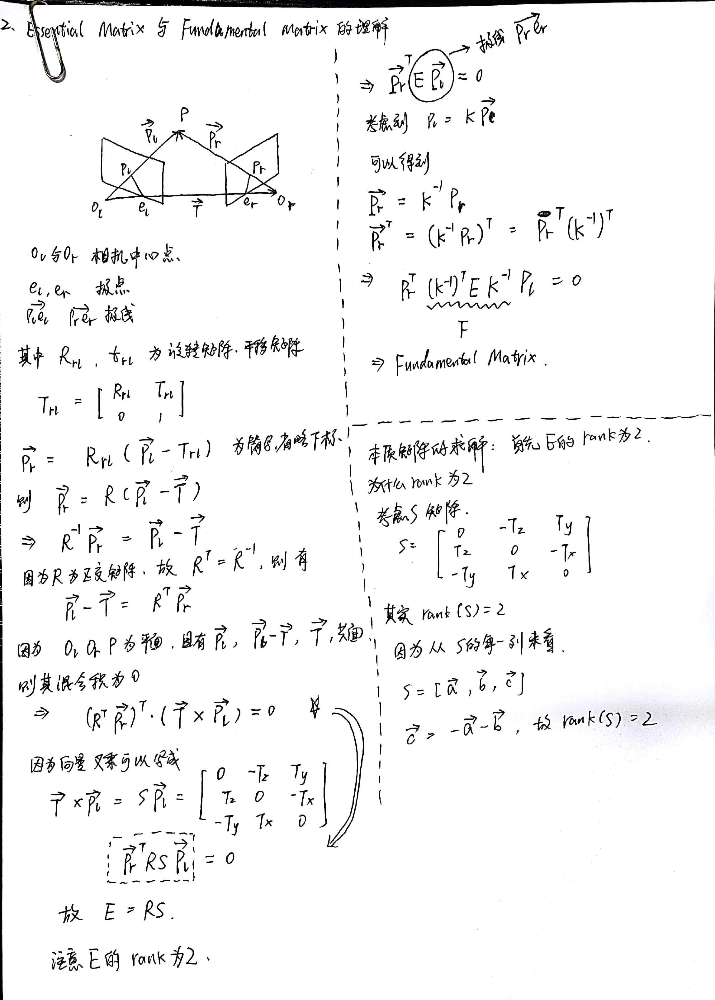
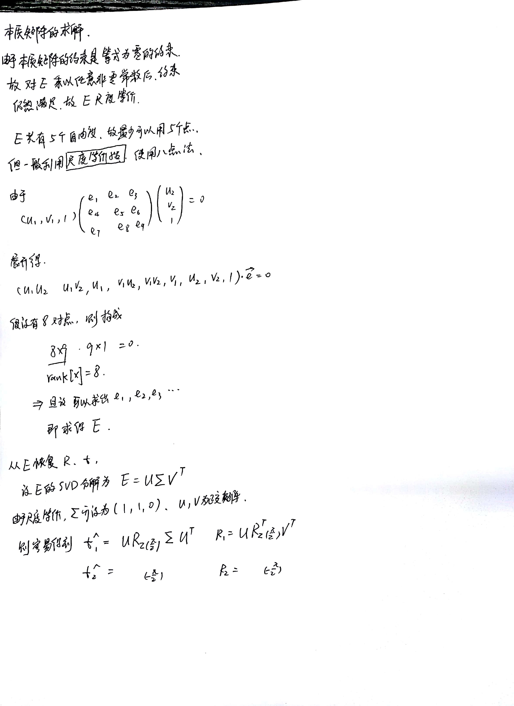

# SLAM基础问题

[TOC]

### 1.欧式变换，相似变换，仿射变换，射影变换的区别？
**欧式变换**
首先**欧式变换**是将刚体在三维环境中原封不动的进行旋转或者平移。

**相似变换**, **仿射变换**, **射影变换**

### 2.Homograph 和 Fundamental Matrix 以及Essential Matrix 的区别，有几个自由度，为什么有这么多自由度，如何计算？

#### Essential Matrix 原理与推导：

#### Essential Matrix 计算方法：

#### Homograph Matrix

### 3.视差与深度的关系?(双目视觉)

