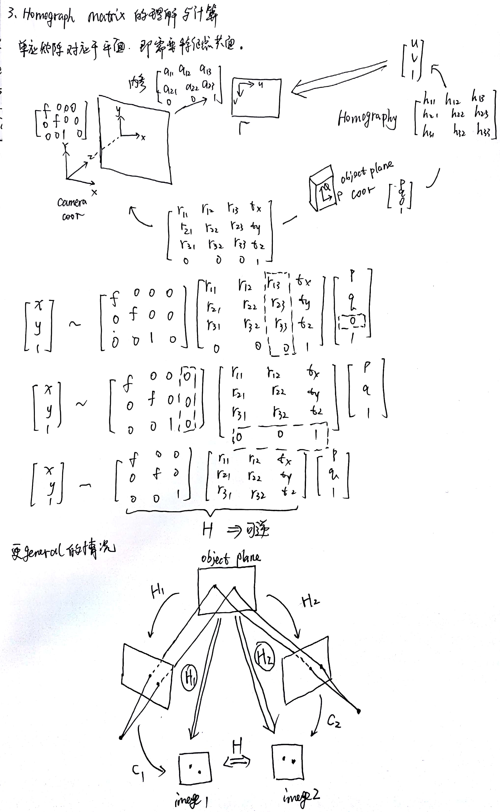
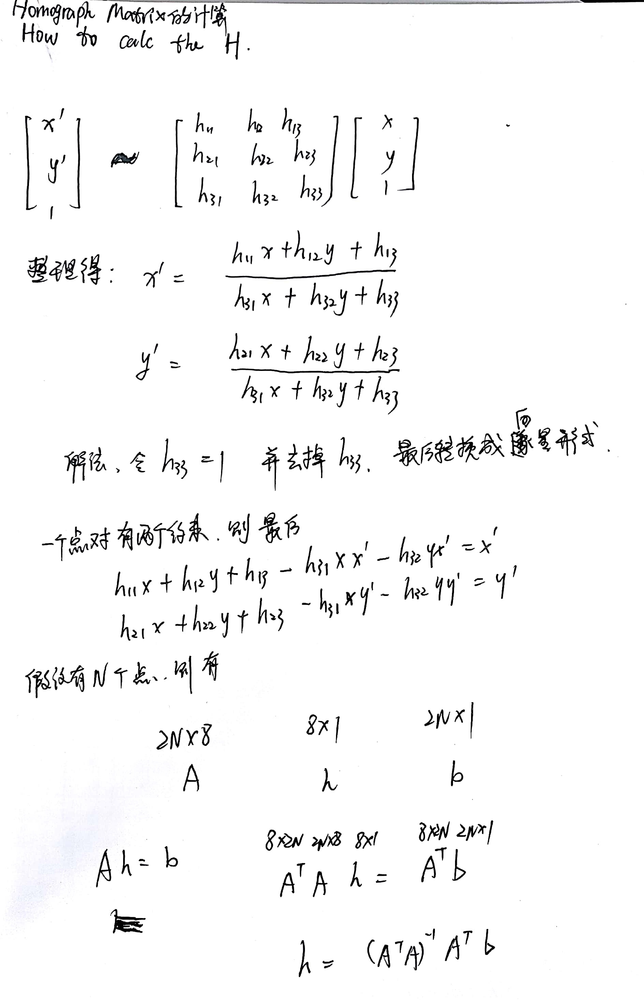
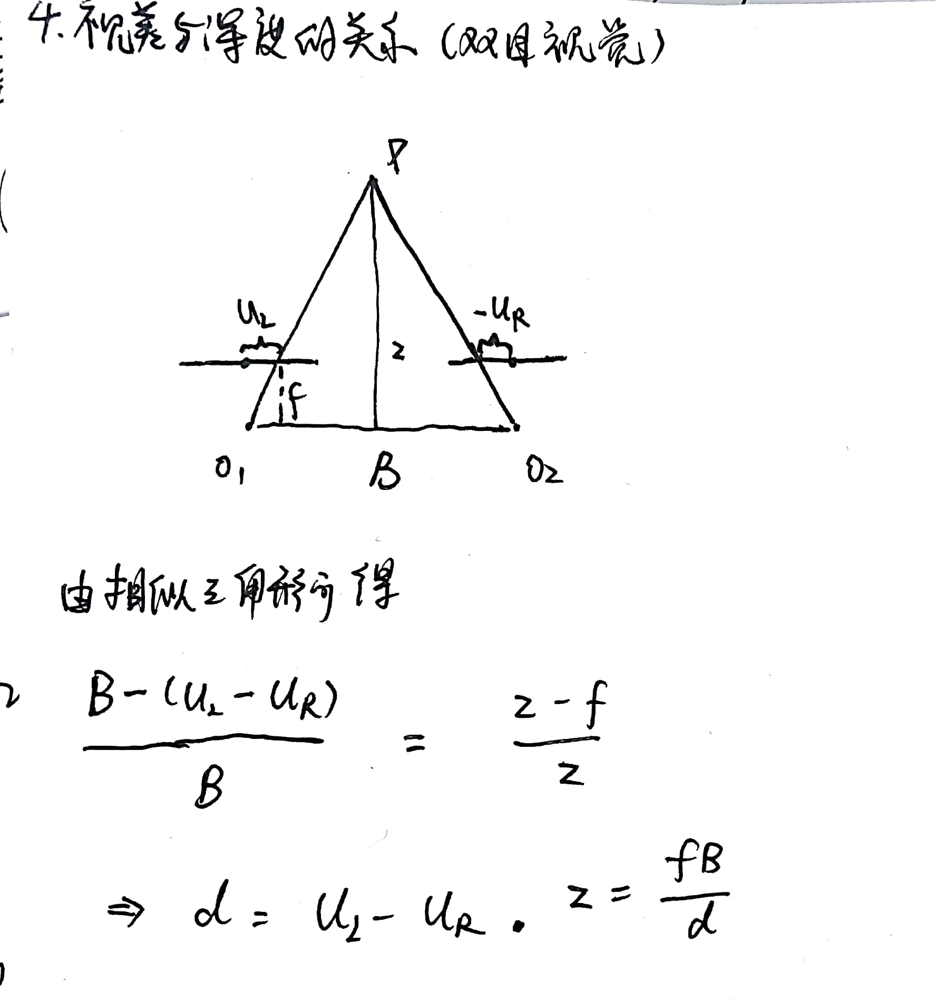

# SLAM基础问题

### 问题列表
*   [1.欧式变换，相似变换，仿射变换，射影变换的区别？](#1)
*   [2.Homograph 和 Fundamental Matrix 以及Essential Matrix 的区别，有几个自由度，为什么有这么多自由度，如何计算？](#2)
    *   [2.1 Essential Matrix 原理与推导](#2.1)
    *   [2.2 Essential Matrix 计算方法](#2.2)
    *   [2.3 Homograph Matrix 原理与推导](#2.3)
    *   [2.4 Homograph Matrix 计算方法](#2.4)
*   [3.视差与深度的关系?(双目视觉)](#3)

### <a name = "1">1.欧式变换，相似变换，仿射变换，射影变换的区别？</a>

**欧式变换**
首先**欧式变换**是将刚体在三维环境中原封不动的进行旋转或者平移。

**相似变换**, **仿射变换**, **射影变换**

### <a name = "2">2.Homograph 和 Fundamental Matrix 以及Essential Matrix 的区别，有几个自由度，为什么有这么多自由度，如何计算？</a>

#### <a name = "2.1">Essential Matrix 原理与推导：</a>

#### <a name = "2.2">Essential Matrix 计算方法：</a>

#### <a name = "2.3">Homograph Matrix 原理与推导</a>

#### <a name = "2.4">2.4 Homograph Matrix 计算方法</a>

### <a name ="3">3.视差与深度的关系?(双目视觉)</a>

